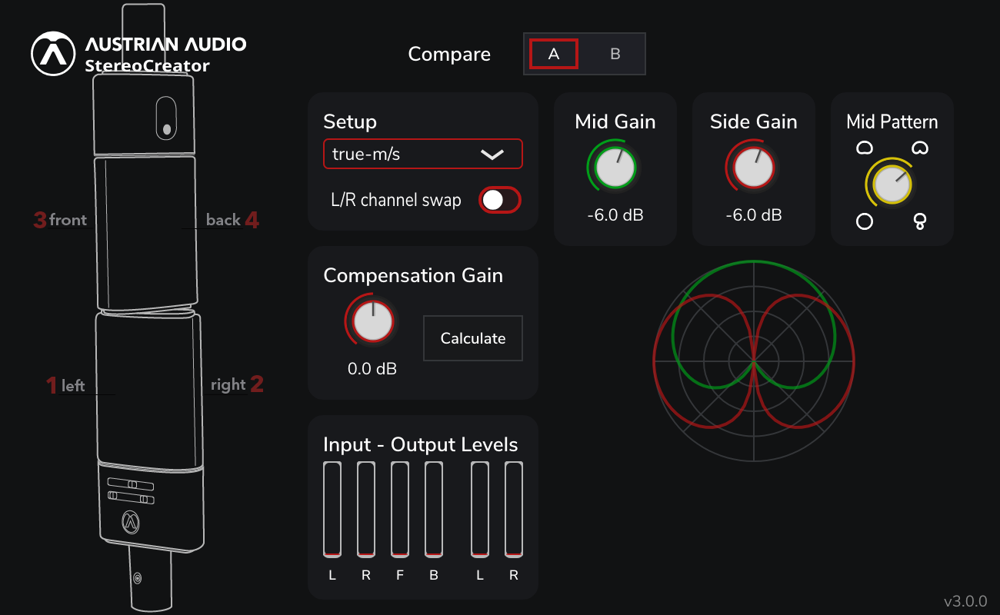

# StereoCreator

Our open-source Stereo plug-in developed by [Simon](https://github.com/becksimon) and [AA](https://austrian.audio/).

The StereoCreator allows you to create several different stereo set-ups with one or two OC818 microphones in dual output mode.
Installers for as VST3, AAX and AU are available at [austrian.audio](https://austrian.audio/).



## Building StereoCreator3 from source

Requirements:

- cmake ( >= v3.24.1)
- a C++20 compatible compiler (GCC, clang, MSVC)

To build from source, you need to clone the repository and its submodules

```bash
git clone https://github.com/AustrianAudioGmbH/StereoCreator.git
cd StereoCreator
git submodule update --init --recursive
```

After that, create a build directory, configure & compile with

```bash
cmake -B build
cmake --build build --config Release
```

## Acknowledgements:

StereoCreator 3 makes use of the following projects:

- [JUCE (audio application framework)](https://juce.com)
- [Pamplejuce (Audio plugin template)](https://github.com/sudara/Pamplejuce)
- [pluginval (VST Plugin validation tests)](https://github.com/Tracktion/pluginval)
- [Catch2 (Unit testing framework)](https://github.com/catchorg/Catch2)
- [IEM Plugin Suite](https://git.iem.at/audioplugins/IEMPluginSuite)
